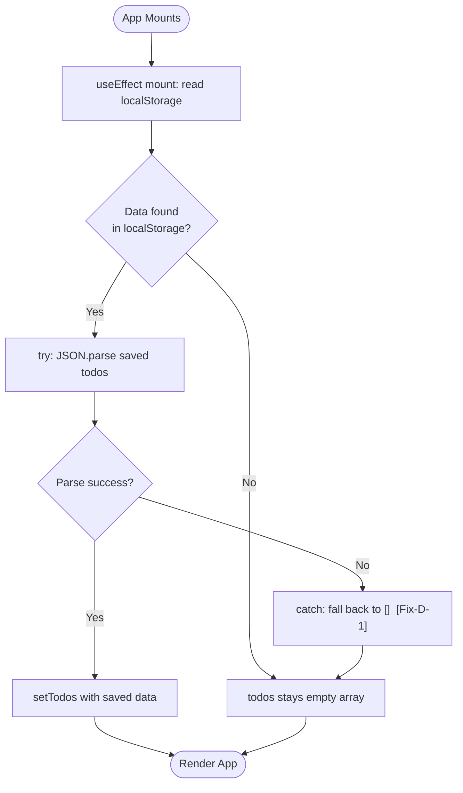
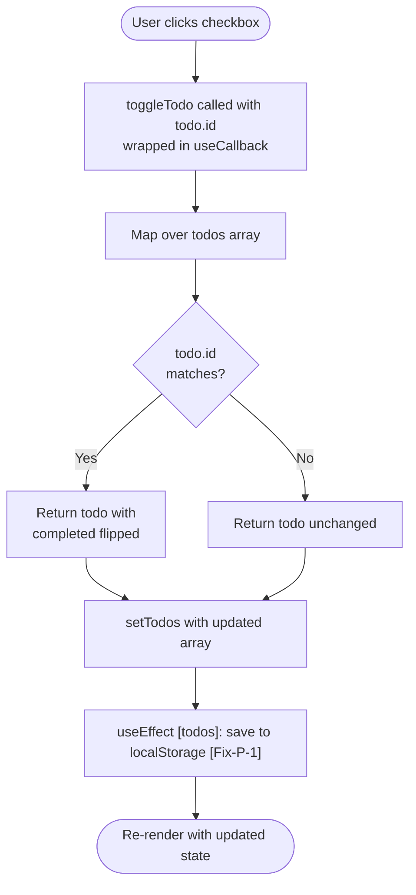
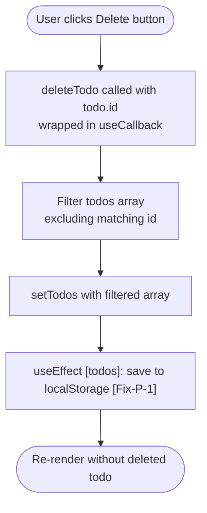
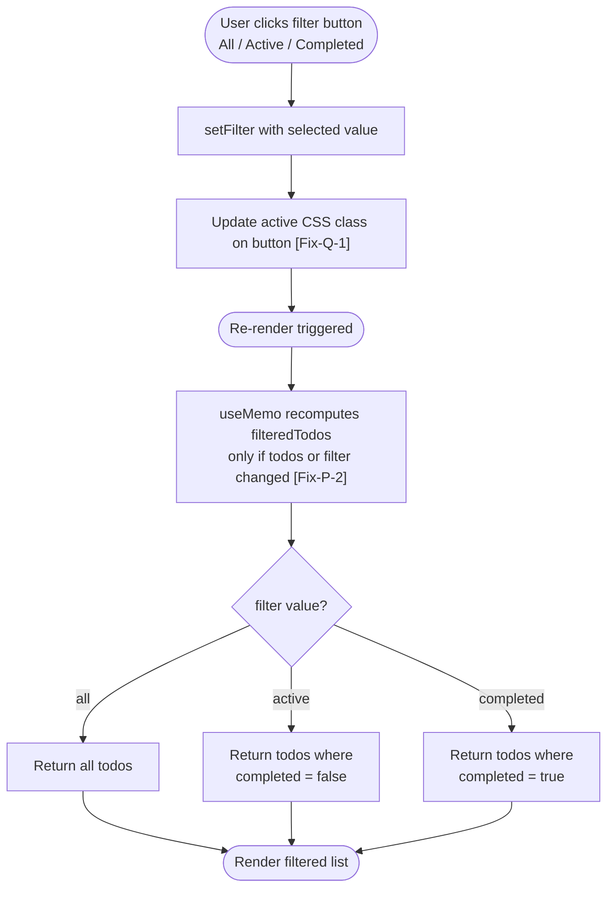
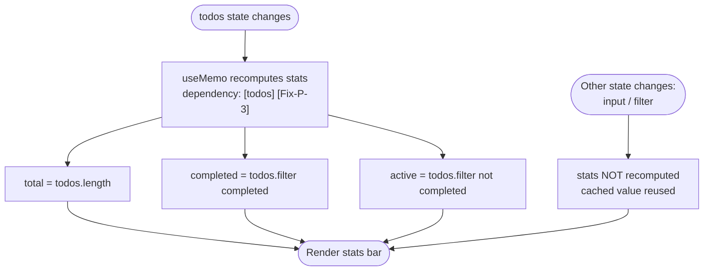
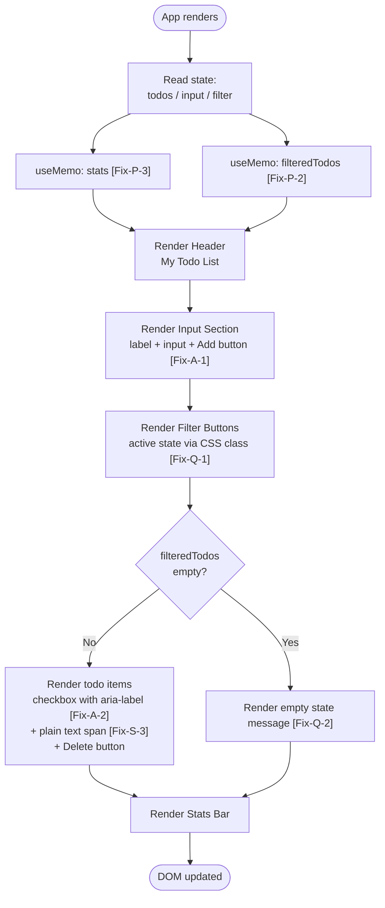
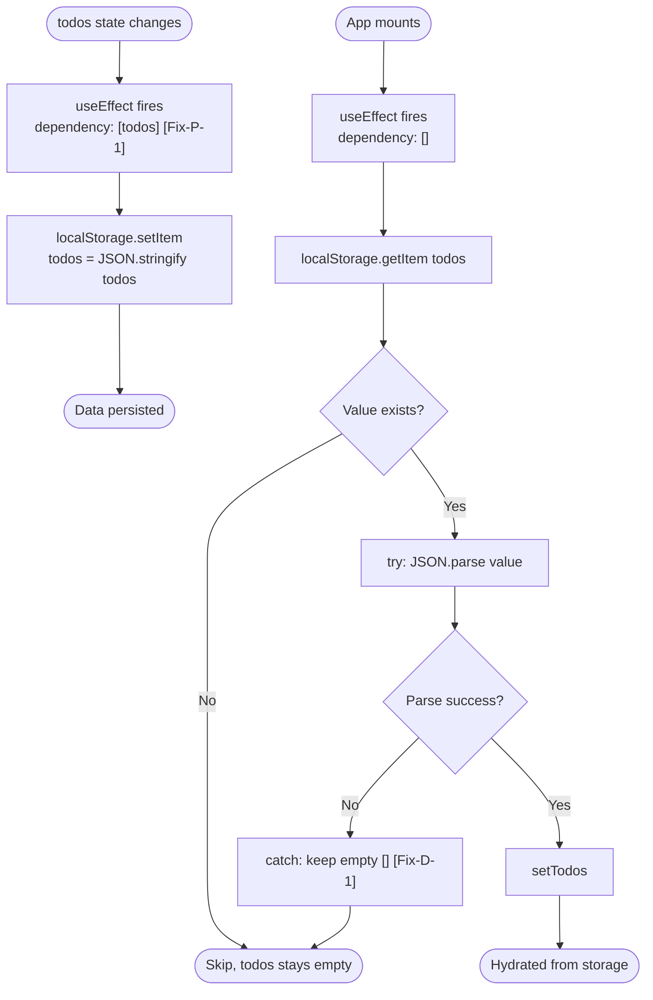

# Flowchart: React Todo List App (Post-Refactor / Target State)

> Flowchart ini menggambarkan **kondisi aplikasi setelah seluruh fix di [prd.md](./prd.md) diterapkan** — bukan kondisi kode saat ini. Setiap node yang berubah dari versi awal diberi tag `[Fix-XX]` merujuk ke ID issue di PRD.

---

## 1. App Initialization



---

## 2. Add Todo Flow

```mermaid
flowchart TD
    A([User types in input]) --> B[onChange: setInput]
    B --> C{Submit via\nButton click\nor Enter via onKeyDown [Fix-A-3]}
    C --> D{input.trim\n=== empty?}
    D -- Yes --> E[alert: Please enter a todo]
    E --> F([No change])
    D -- No --> G["Create newTodo object\nid: crypto.randomUUID() [Fix-P-6]\ntext: input\ncompleted: false\ncreatedAt: ISO string"]
    G --> H["setTodos: append newTodo\n(addTodo wrapped in useCallback [Fix-P-4])"]
    H --> I[setInput: reset to empty]
    I --> J["useEffect [todos]: save to localStorage [Fix-P-1]"]
    J --> K([Re-render with new todo list])
```

---

## 3. Toggle Todo Flow



---

## 4. Delete Todo Flow



---

## 5. Filter Flow



---

## 6. Stats Calculation Flow



---

## 7. Full App Render Flow (High-Level)



> Catatan: tidak ada lagi `console.log` debug `[Fix-Q-3]` maupun `API_KEY` `[Fix-S-1, S-2]` di render body.

---

## 8. localStorage Persistence Flow


