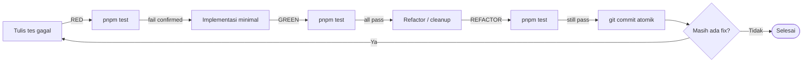

# TDD Schema (Lengkap): React Todo List Refactoring

Dokumen ini adalah **rencana test-driven development lengkap** untuk pekerjaan refactoring yang dijelaskan di [prd.md](./prd.md). Setiap perubahan kode mengikuti siklus **Red → Green → Refactor**: tulis tes dulu, lihat gagal, implementasi minimal, lalu rapikan.

> **Scope alignment dengan PRD:** Tes dan setup di dokumen ini dibagi dua tier:
> - **PRD-required** — wajib untuk memenuhi acceptance criteria di [prd.md](./prd.md). Tes-tes ini langsung memetakan ke issue ID PRD.
> - **Optional (di luar PRD)** — peningkatan tambahan (extra a11y, coverage tooling, user-event lib). Tidak boleh memblokir delivery dan tidak masuk acceptance criteria. Ditandai eksplisit dengan label **[OPTIONAL]**.
>
> PRD scope eksplisit: "Out of scope: New features, full rewrites, changes to test files, or changes to project configuration." Karena itu modifikasi `vite.config.js` dan penambahan dev dependency diklasifikasikan sebagai opsional.

---

## Daftar Isi

1. [Filosofi & Prinsip](#1-filosofi--prinsip)
2. [Testing Stack](#2-testing-stack)
3. [Struktur Folder Tes](#3-struktur-folder-tes)
4. [Test Pyramid & Kategori](#4-test-pyramid--kategori)
5. [Test Fixtures & Helpers](#5-test-fixtures--helpers)
6. [Test Matrix Lengkap](#6-test-matrix-lengkap)
7. [Detail Tes per Kategori (dengan kode)](#7-detail-tes-per-kategori-dengan-kode)
8. [Red-Green-Refactor Workflow](#8-red-green-refactor-workflow)
9. [Commit-to-Test Mapping](#9-commit-to-test-mapping)
10. [Konvensi Penulisan Tes](#10-konvensi-penulisan-tes)
11. [Mock & Spy Strategy](#11-mock--spy-strategy)
12. [Coverage Goals & Reporting](#12-coverage-goals--reporting)
13. [CI Integration](#13-ci-integration)
14. [Definition of Done](#14-definition-of-done)
15. [Checklist Eksekusi](#15-checklist-eksekusi)

---

## 1. Filosofi & Prinsip

| Prinsip | Penjelasan |
|---------|-----------|
| **Test first** | Tes ditulis **sebelum** fix diimplementasi. Tes harus gagal dulu (red) untuk membuktikan tes-nya valid. |
| **One behavior per test** | Setiap blok `it()` menguji satu perilaku yang bisa dijelaskan dalam satu kalimat. |
| **Test the user, not the code** | Query lewat role / label / text yang dilihat user, bukan via `data-testid` atau implementasi internal. |
| **Arrange-Act-Assert** | Setiap tes memiliki 3 bagian jelas: setup state, lakukan aksi, verifikasi hasil. |
| **Isolation** | Setiap tes mandiri — tidak bergantung urutan eksekusi. `beforeEach` reset semua state global (localStorage, mock). |
| **Determinism** | Tidak ada `setTimeout`/race condition. Gunakan `findBy*` untuk async, bukan `sleep`. |
| **Refactor without rewrite** | Saat refactor produksi, tes tidak boleh berubah (kecuali API kontraknya berubah). |

---

## 2. Testing Stack

| Layer | Tool | Versi (dari package.json) | Status |
|-------|------|---------------------------|--------|
| Test runner | Vitest | 2.x | sudah ada |
| DOM library | @testing-library/react | 16.x | sudah ada |
| Assertions | @testing-library/jest-dom | 6.x | sudah ada |
| Environment | jsdom (via Vitest) | - | sudah ada |
| User interaction | @testing-library/user-event | 14.x | **[OPTIONAL]** — bisa diganti `fireEvent` (lihat 5.2) |
| Coverage | @vitest/coverage-v8 | - | **[OPTIONAL]** — coverage di luar PRD scope |

**Setup file:** `src/test/setup.js`

```js
import '@testing-library/jest-dom/vitest'
import { afterEach, vi } from 'vitest'
import { cleanup } from '@testing-library/react'

afterEach(() => {
  cleanup()
  localStorage.clear()
  vi.restoreAllMocks()
})
```

---

## 3. Struktur Folder Tes

```
src/
├── App.jsx
├── App.test.jsx              # tes utama (behavior + integrasi)
├── test/
│   ├── setup.js              # global setup (jest-dom, cleanup)
│   ├── fixtures.js           # data dummy untuk tes
│   └── helpers.js            # render helper, user-event setup
└── main.jsx
```

---

## 4. Test Pyramid & Kategori

```
            ┌──────────────┐
            │  E2E (0)     │   — tidak digunakan di assessment ini
            └──────────────┘
        ┌──────────────────────┐
        │ Integration (15-20) │   — interaksi user × DOM × state
        └──────────────────────┘
   ┌──────────────────────────────┐
   │  Unit (opsional, util only) │   — pure functions, jika ada
   └──────────────────────────────┘
```

Karena aplikasi kecil dan semua logika ada di satu komponen, **mayoritas tes berbentuk integration test** yang me-render `<App />` dan berinteraksi seperti user.

| Kategori | Jumlah Tes | Tujuan |
|----------|-----------|--------|
| Behavior | 5 (existing) + 5 (new) | Verifikasi fungsi terlihat user: tambah, toggle, hapus, filter |
| Persistence | 3 | Read/write localStorage, fallback malformed data |
| Security | 2 | No XSS, no hardcoded secrets |
| Accessibility | 3 | Label, ARIA, keyboard |
| Edge cases | 2 | Input kosong, list kosong |

**Total: 20 tes** (5 existing + 15 baru).

---

## 5. Test Fixtures & Helpers

### 5.1 `src/test/fixtures.js`

```js
export const sampleTodo = {
  id: 'fixed-id-001',
  text: 'Sample todo',
  completed: false,
  createdAt: '2026-01-01T00:00:00.000Z',
}

export const todoList = [
  { id: '1', text: 'Buy milk', completed: false, createdAt: '2026-01-01T00:00:00.000Z' },
  { id: '2', text: 'Walk dog',  completed: true,  createdAt: '2026-01-02T00:00:00.000Z' },
  { id: '3', text: 'Read book', completed: false, createdAt: '2026-01-03T00:00:00.000Z' },
]

export const xssPayload = ''
```

### 5.2 `src/test/helpers.js`

**Versi A — pakai `user-event` (rekomendasi, butuh dev dep tambahan [OPTIONAL]):**

```js
import { render } from '@testing-library/react'
import userEvent from '@testing-library/user-event'
import App from '../App'

export function renderApp() {
  const user = userEvent.setup()
  const utils = render(<App />)
  return { user, ...utils }
}

export function seedLocalStorage(todos) {
  localStorage.setItem('todos', JSON.stringify(todos))
}
```

**Versi B — tanpa dep tambahan, pakai `fireEvent` (sesuai PRD scope):**

```js
import { render, fireEvent } from '@testing-library/react'
import App from '../App'

export function renderApp() {
  const utils = render(<App />)
  // helper kompat dengan API user-event yang dipakai di section 7
  const user = {
    type: (el, text) => {
      // dukung suffix {Enter}
      const enter = text.endsWith('{Enter}')
      const value = enter ? text.replace('{Enter}', '') : text
      fireEvent.change(el, { target: { value } })
      if (enter) fireEvent.keyDown(el, { key: 'Enter' })
    },
    click: (el) => fireEvent.click(el),
  }
  return { user, ...utils }
}

export function seedLocalStorage(todos) {
  localStorage.setItem('todos', JSON.stringify(todos))
}
```

> Pilih salah satu. Versi B menghindari penambahan dev dependency sehingga konsisten dengan PRD scope ("changes to project configuration" out of scope).

---

## 6. Test Matrix Lengkap

### 6.1 Behavior (existing — wajib tetap lulus)

| ID | Deskripsi | PRD ref |
|----|-----------|---------|
| T-01 | Render judul "My Todo List" | — |
| T-02 | Tambah todo via tombol Add | — |
| T-03 | Toggle complete via checkbox | — |
| T-04 | Hapus todo via tombol Delete | — |
| T-05 | Stats Total/Active update saat todo ditambah | — |

### 6.2 Security

| ID | Deskripsi | PRD ref |
|----|-----------|---------|
| T-06 | Input user di-render sebagai plain text (anti-XSS) | S-3 |
| T-07 | Tidak ada string `sk-` (atau pola API key) di source `App.jsx` | S-1, S-2 |

### 6.3 Persistence

| ID | Deskripsi | PRD ref |
|----|-----------|---------|
| T-08 | Memuat todos dari localStorage saat mount | — |
| T-09 | Menyimpan todos ke localStorage saat berubah | P-1 |
| T-10 | Tidak crash saat localStorage berisi JSON rusak | D-1 |

### 6.4 Edge cases & Filter

| ID | Deskripsi | PRD ref |
|----|-----------|---------|
| T-11 | Tampil empty state saat tidak ada todo | Q-2 |
| T-12 | Tampil empty state saat filter tidak match | Q-2 |
| T-13 | Filter Active hanya menampilkan yang belum selesai | — |
| T-14 | Filter Completed hanya menampilkan yang selesai | — |
| T-15 | Input whitespace murni tidak menambah todo | — |
| T-16 | Tombol Enter (onKeyDown) menambah todo | A-3 |
| T-17 | Dua todo dalam tick yang sama punya ID berbeda | P-6 |

### 6.5 Accessibility

| ID | Deskripsi | PRD ref |
|----|-----------|---------|
| T-18 | Input punya label aksesibel | A-1 |
| T-19 | Setiap checkbox punya accessible name dari teks todo | A-2 |
| T-20 | **[OPTIONAL]** Filter button menunjukkan state aktif via `aria-pressed` | tidak di PRD — improvement a11y tambahan, di luar acceptance criteria |

---

## 7. Detail Tes per Kategori (dengan kode)

### 7.1 Behavior — existing tests (sudah ada di `App.test.jsx`)

```js
// T-01
it('renders todo app title', () => {
  render(<App />)
  expect(screen.getByText('My Todo List')).toBeInTheDocument()
})

// T-02
it('can add a new todo', async () => {
  const { user } = renderApp()
  await user.type(screen.getByPlaceholderText('What needs to be done?'), 'Test todo')
  await user.click(screen.getByText('Add'))
  expect(screen.getByText('Test todo')).toBeInTheDocument()
})
```

### 7.2 Security

#### T-06 — Anti-XSS

```js
// RED dulu: jalankan tes sebelum fix S-3 diterapkan → harus gagal
it('renders user input as plain text, not HTML (no XSS)', async () => {
  const { user } = renderApp()
  await user.type(
    screen.getByPlaceholderText('What needs to be done?'),
    ''
  )
  await user.click(screen.getByText('Add'))

  // Literal string ada di DOM
  expect(
    screen.getByText('')
  ).toBeInTheDocument()

  // Tidak ada  yang sebenarnya ter-render
  expect(document.querySelector('img')).toBeNull()

  // Tidak ada side-effect XSS
  expect(window.__xss).toBeUndefined()
})
```

#### T-07 — Tidak ada API key di source

```js
import fs from 'node:fs'
import path from 'node:path'

it('does not contain hardcoded API keys in App.jsx', () => {
  const source = fs.readFileSync(
    path.resolve(__dirname, './App.jsx'),
    'utf8'
  )
  expect(source).not.toMatch(/sk-[a-zA-Z0-9]{8,}/)
  expect(source).not.toMatch(/API_KEY\s*=\s*['"`]/)
})
```

### 7.3 Persistence

#### T-08 — Restore from localStorage

```js
it('restores todos from localStorage on mount', () => {
  seedLocalStorage([
    { id: 'a', text: 'Persisted todo', completed: false, createdAt: '' }
  ])
  render(<App />)
  expect(screen.getByText('Persisted todo')).toBeInTheDocument()
})
```

#### T-09 — Save to localStorage (verifikasi setelah fix P-1)

```js
it('persists todos to localStorage when added', async () => {
  const { user } = renderApp()
  await user.type(screen.getByLabelText(/todo/i), 'Persist me')
  await user.click(screen.getByText('Add'))

  const stored = JSON.parse(localStorage.getItem('todos'))
  expect(stored).toHaveLength(1)
  expect(stored[0].text).toBe('Persist me')
})
```

#### T-10 — Malformed JSON fallback

```js
it('does not crash when localStorage contains malformed JSON', () => {
  localStorage.setItem('todos', '{ not valid json')
  expect(() => render(<App />)).not.toThrow()
  // Empty state harus muncul (atau setidaknya tidak ada item)
  expect(screen.queryAllByRole('checkbox')).toHaveLength(0)
})
```

### 7.4 Edge cases & Filter

#### T-11 — Empty state on first load

```js
it('shows empty state when there are no todos', () => {
  render(<App />)
  expect(screen.getByText(/no todos/i)).toBeInTheDocument()
})
```

#### T-12 — Empty state on filtered view

```js
it('shows empty state when filter has no matches', async () => {
  const { user } = renderApp()
  await user.type(screen.getByLabelText(/todo/i), 'Active task')
  await user.click(screen.getByText('Add'))

  await user.click(screen.getByRole('button', { name: /completed/i }))
  expect(screen.getByText(/no todos/i)).toBeInTheDocument()
})
```

#### T-13 — Filter Active

```js
it('filter "Active" hides completed todos', async () => {
  const { user } = renderApp()
  // Tambah 2 todo
  await user.type(screen.getByLabelText(/todo/i), 'Active task')
  await user.click(screen.getByText('Add'))
  await user.type(screen.getByLabelText(/todo/i), 'Done task')
  await user.click(screen.getByText('Add'))

  // Selesaikan "Done task"
  const doneCheckbox = screen.getByRole('checkbox', { name: /Done task/i })
  await user.click(doneCheckbox)

  // Klik filter Active
  await user.click(screen.getByRole('button', { name: /active/i }))

  expect(screen.getByText('Active task')).toBeInTheDocument()
  expect(screen.queryByText('Done task')).not.toBeInTheDocument()
})
```

#### T-14 — Filter Completed (analog T-13, dibalik)

```js
it('filter "Completed" hides active todos', async () => {
  // ... setup sama, klik filter Completed di akhir
})
```

#### T-15 — Whitespace input

```js
it('does not add a todo when input is only whitespace', async () => {
  const { user } = renderApp()
  const alertSpy = vi.spyOn(window, 'alert').mockImplementation(() => {})

  await user.type(screen.getByLabelText(/todo/i), '   ')
  await user.click(screen.getByText('Add'))

  expect(screen.queryAllByRole('checkbox')).toHaveLength(0)
  expect(alertSpy).toHaveBeenCalled()
})
```

#### T-16 — Enter key submit (onKeyDown setelah fix A-3)

```js
it('submits the todo when Enter is pressed', async () => {
  const { user } = renderApp()
  const input = screen.getByLabelText(/todo/i)
  await user.type(input, 'Via Enter{Enter}')
  expect(screen.getByText('Via Enter')).toBeInTheDocument()
})
```

#### T-17 — Unique IDs even in same millisecond

```js
it('generates unique IDs for todos added in the same tick', async () => {
  const { user } = renderApp()
  // Bekukan Date.now untuk membuktikan ID tidak bergantung waktu
  vi.spyOn(Date, 'now').mockReturnValue(1700000000000)

  await user.type(screen.getByLabelText(/todo/i), 'First')
  await user.click(screen.getByText('Add'))
  await user.type(screen.getByLabelText(/todo/i), 'Second')
  await user.click(screen.getByText('Add'))

  const stored = JSON.parse(localStorage.getItem('todos'))
  expect(stored[0].id).not.toBe(stored[1].id)
})
```

### 7.5 Accessibility

#### T-18 — Input label

```js
it('input has an accessible label', () => {
  render(<App />)
  // Sekarang query bisa pakai getByLabelText
  expect(screen.getByLabelText(/todo/i)).toBeInTheDocument()
})
```

#### T-19 — Checkbox accessible name

```js
it('each todo checkbox is named by its todo text', async () => {
  const { user } = renderApp()
  await user.type(screen.getByLabelText(/todo/i), 'Buy milk')
  await user.click(screen.getByText('Add'))

  expect(
    screen.getByRole('checkbox', { name: /Buy milk/i })
  ).toBeInTheDocument()
})
```

#### T-20 — Active filter exposed to AT **[OPTIONAL]**

> Tes ini tidak di-cover PRD. Jangan dijadikan blocker — boleh dilewati untuk tetap dalam scope, atau ditulis terpisah sebagai improvement opsional.

```js
it('marks the active filter button with aria-pressed', async () => {
  const { user } = renderApp()
  const activeBtn = screen.getByRole('button', { name: /active/i })

  expect(activeBtn).toHaveAttribute('aria-pressed', 'false')
  await user.click(activeBtn)
  expect(activeBtn).toHaveAttribute('aria-pressed', 'true')
})
```

---

## 8. Red-Green-Refactor Workflow



**Aturan emas:**
- Jangan tulis kode produksi tanpa tes yang gagal lebih dulu.
- Jangan tulis lebih banyak tes dari yang cukup untuk membuatnya gagal.
- Jangan tulis lebih banyak kode produksi dari yang cukup untuk membuatnya lulus.

---

## 9. Commit-to-Test Mapping

| Commit | Tes yang harus lulus sebelum commit |
|--------|-------------------------------------|
| `fix(security): remove exposed API key and debug log` | T-01..T-05, T-07 |
| `fix(security): replace dangerouslySetInnerHTML with plain text` | T-01..T-05, T-06 |
| `fix(perf): add [todos] dep array to save effect` | T-01..T-05, T-08, T-09 |
| `fix(perf): memoize filtered todos and stats` | T-01..T-05, T-13, T-14 |
| `fix(perf): wrap addTodo in useCallback` | T-01..T-05 |
| `fix(perf): use crypto.randomUUID for todo ids` | T-01..T-05, T-17 |
| `fix(quality): replace inline styles with CSS classes` | T-01..T-05 (T-20 hanya jika improvement opsional diambil) |
| `fix(quality): empty state + remove console.logs` | T-01..T-05, T-11, T-12 |
| `fix(a11y): label input and checkbox` | T-01..T-05, T-18, T-19 |
| `fix(a11y): replace onKeyPress with onKeyDown` | T-01..T-05, T-16 |
| `fix(dx): try/catch around JSON.parse from localStorage` | T-01..T-05, T-10 |

---

## 10. Konvensi Penulisan Tes

### Template wajib

```js
import { describe, it, expect, beforeEach, vi } from 'vitest'
import { screen } from '@testing-library/react'
import { renderApp, seedLocalStorage } from './test/helpers'

describe('App — <kelompok fitur>', () => {
  it('<deskripsi behavior dalam Bahasa Inggris>', async () => {
    // Arrange
    const { user } = renderApp()

    // Act
    await user.type(screen.getByLabelText(/todo/i), 'X')
    await user.click(screen.getByText('Add'))

    // Assert
    expect(screen.getByText('X')).toBeInTheDocument()
  })
})
```

### Aturan

| Aturan | Penjelasan |
|--------|-----------|
| Satu `it` = satu behavior | Jangan menumpuk 3 assertion yang tidak terkait |
| Reset side-effect di `afterEach` | Sudah dilakukan di `setup.js` |
| Hindari `data-testid` | Pakai role / label / text dulu, `testid` hanya jika tidak ada cara lain |
| Hindari `container.querySelector` | Kecuali untuk verifikasi negatif (misal "tidak ada ``") |
| Hindari `await new Promise(setTimeout)` | Gunakan `findBy*` atau `waitFor` |
| Penamaan deskriptif | "renders X" bukan "test 1" |
| Jangan tes implementasi | Jangan tes nama state, nama fungsi, atau order setState |

---

## 11. Mock & Spy Strategy

| Hal yang di-mock | Cara | Alasan |
|------------------|------|--------|
| `localStorage` | Tidak di-mock — pakai jsdom built-in, di-clear di `afterEach` | Lebih realistis |
| `window.alert` | `vi.spyOn(window, 'alert').mockImplementation(() => {})` | Mencegah popup dan memungkinkan assertion |
| `Date.now` | `vi.spyOn(Date, 'now').mockReturnValue(...)` | Untuk tes T-17 (membuktikan ID tidak tergantung waktu) |
| `crypto.randomUUID` | **Tidak** di-mock di tes biasa | Biarkan implementasi sebenarnya berjalan |
| `console.log` / `console.error` | `vi.spyOn(console, 'error').mockImplementation(() => {})` di tes T-10 | Mencegah noise output saat menguji error path |

---

## 12. Coverage Goals & Reporting **[OPTIONAL]**

> Bagian ini di luar PRD scope (PRD eksplisit menyatakan "changes to project configuration" out of scope). Acceptance criteria PRD hanya butuh `pnpm test` lulus, bukan target coverage. Jangan modifikasi `vite.config.js` sebagai bagian dari delivery PRD — bagian ini hanya untuk improvement post-PRD.

**Target opsional (kalau tim memutuskan mengejar coverage di iterasi berikutnya):**

| Metrik | Target | Alasan |
|--------|--------|--------|
| Statements | ≥ 90% | App kecil, semua jalur mudah dicover |
| Branches | ≥ 85% | Mencakup semua `if/else` (filter, validasi input, fallback) |
| Functions | 100% | Setiap handler dipanggil di tes |
| Lines | ≥ 90% | — |

**Setup coverage di `vite.config.js` (HANYA jika improvement opsional ini diambil):**

```js
test: {
  globals: true,
  environment: 'jsdom',
  setupFiles: './src/test/setup.js',
  coverage: {
    provider: 'v8',
    reporter: ['text', 'html', 'lcov'],
    exclude: ['node_modules/', 'src/test/', '**/*.config.js'],
    thresholds: {
      statements: 90,
      branches: 85,
      functions: 100,
      lines: 90,
    },
  },
},
```

**Jalankan:**

```bash
pnpm test --coverage
```

Buka `coverage/index.html` di browser untuk laporan visual.

---

## 13. CI Integration

Pipeline minimum di `.github/workflows/ci.yml` (referensi — bukan deliverable):

```yaml
name: CI
on: [push, pull_request]
jobs:
  test:
    runs-on: ubuntu-latest
    steps:
      - uses: actions/checkout@v4
      - uses: pnpm/action-setup@v3
        with: { version: 9 }
      - uses: actions/setup-node@v4
        with: { node-version: 22, cache: pnpm }
      - run: pnpm install --frozen-lockfile
      - run: pnpm test --coverage
      - uses: codecov/codecov-action@v4
        with: { files: ./coverage/lcov.info }
```

**Aturan CI:**
- Setiap PR harus lulus seluruh test suite.
- Coverage tidak boleh turun dari baseline.
- Tidak ada `test.only` / `it.only` di branch yang akan di-merge.

---

## 14. Definition of Done

Sebuah refactor "selesai" hanya jika **semua** poin ini terpenuhi:

1. ✅ Tes baru ditulis lebih dulu dan **gagal** sebelum fix.
2. ✅ Tes baru **lulus** setelah fix.
3. ✅ Semua tes sebelumnya (T-01..T-N) tetap lulus.
4. ✅ Commit atomik: satu fix per commit, pesan mengikuti konvensi di [prd.md](./prd.md).
5. ✅ Tidak ada `console.log` baru tertinggal.
6. ✅ Tidak ada `test.only` / `describe.only` tertinggal.
7. ✅ `pnpm test` exit code 0.
8. ⚪ **[OPTIONAL]** Coverage threshold tidak turun (hanya jika improvement coverage opsional diambil).

---

## 15. Checklist Eksekusi

Gunakan sebagai checklist saat mengerjakan:

### Fase 1: Setup
- [ ] Baca seluruh `App.jsx` dan `App.test.jsx`
- [ ] Jalankan `pnpm install`
- [ ] Jalankan `pnpm test` → konfirmasi 5 tes existing lulus
- [ ] Buat `src/test/helpers.js` dan `src/test/fixtures.js` (pakai Versi B di 5.2 untuk tetap dalam PRD scope, atau Versi A jika menambah dep diizinkan)
- [ ] **[OPTIONAL]** Tambah `@testing-library/user-event` — di luar PRD scope

### Fase 2: Security (prioritas tertinggi)
- [ ] T-07: Tulis tes "no API key" → red → hapus `API_KEY` dan `console.log API_KEY` → green → commit
- [ ] T-06: Tulis tes XSS → red → ganti `dangerouslySetInnerHTML` jadi `{todo.text}` → green → commit

### Fase 3: Persistence & DX
- [ ] T-09: Tulis tes persist → red (karena dep array hilang menyebabkan flicker) → tambah `[todos]` → green → commit
- [ ] T-10: Tulis tes malformed JSON → red (crash) → bungkus try/catch → green → commit
- [ ] T-08: Tulis tes restore → harusnya sudah hijau, tambah sebagai regression guard

### Fase 4: Performance
- [ ] Tulis ulang `getFilteredTodos` jadi `useMemo` (T-13/T-14 sebagai regression)
- [ ] Tulis ulang `stats` jadi `useMemo` (T-05 sebagai regression)
- [ ] Wrap `addTodo` / `toggleTodo` / `deleteTodo` dengan `useCallback`
- [ ] T-17: Tulis tes unique ID → red → ganti `Date.now()` jadi `crypto.randomUUID()` → green → commit

### Fase 5: Accessibility
- [ ] T-18: Tulis tes label input → red → tambah `<label>` → green → commit
- [ ] T-19: Tulis tes checkbox name → red → tambah `aria-label` → green → commit
- [ ] T-16: Tulis tes Enter key → red → ganti `onKeyPress` → `onKeyDown` → green → commit

### Fase 6: Code Quality
- [ ] T-11/T-12: Tulis tes empty state → red → tambah branch empty → green → commit
- [ ] Q-1: Ganti inline style jadi CSS class (sesuai PRD) → commit
- [ ] **[OPTIONAL]** T-20: Tulis tes aria-pressed → tambah `aria-pressed` ke filter button (di luar PRD)
- [ ] Hapus `console.log('Rendering with todos:', todos)` → commit

### Fase 7: Verifikasi akhir
- [ ] `pnpm test` → semua hijau (acceptance criteria PRD)
- [ ] **[OPTIONAL]** `pnpm test --coverage` → threshold tercapai (hanya jika coverage opsional diambil)
- [ ] Manual smoke test: `pnpm dev` → add, toggle, delete, filter, refresh
- [ ] `git log --oneline` → setiap commit jelas dan atomik
